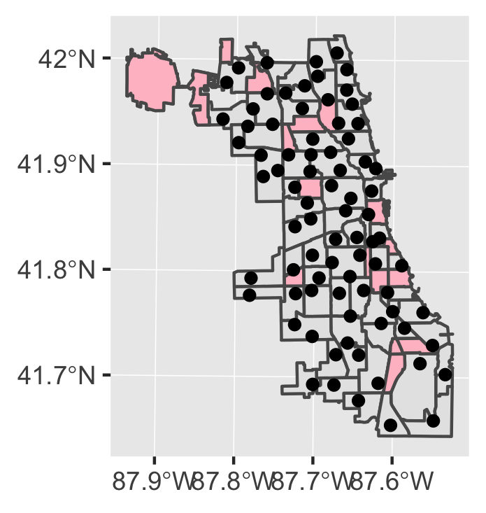

```{r setup, include=FALSE}
knitr::opts_chunk$set(echo = TRUE)
```

## Data Used 

Here is an explanation of the data I used in this analysis:

- [**Library data**](https://data.cityofchicago.org/Parks-Recreation/Waterways/eg9f-z3t6): points
- **Community area data**: polygons

### Rationale for Data
Why I used this data:

1. *Different geometries*
2. *Relevant and interesting*



# Load packages
```{r, message=FALSE, warning=FALSE}
library(sf)
library(ggplot2)
library(dplyr)
```

# Read and project data
```{r results='hide'}
areas <- st_read("https://data.cityofchicago.org/resource/igwz-8jzy.geojson")
libraries <- st_read("https://data.cityofchicago.org/resource/psqp-6rmg.geojson")

areas <- st_transform(areas, 32616)
libraries <- st_transform(libraries, 32616)
```

# Make a ggplot!
```{r map, echo=FALSE, fig.height=2, fig.width=2}
ggplot() +
  geom_sf(data = areas) +
  geom_sf(data = libraries)
```

# A useful shortcut
Use `Ctrl-Alt-I` to insert a code chunk. Or click the "Insert" button at the top of a R Markdown document.
